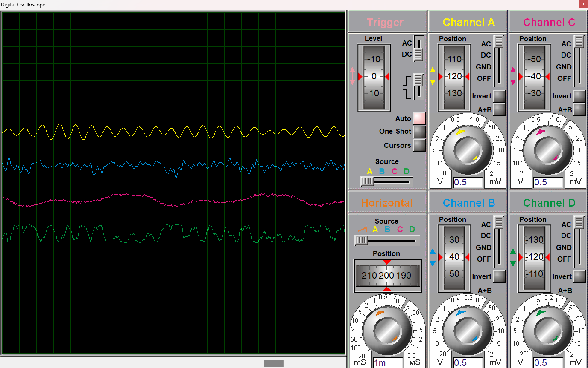

# 🎸 Projeto02 – Somador com AMP OP TL02 no Proteus (Guns N' Roses)

Este projeto simula um **amplificador somador inversor** utilizando o **TL02** no **Proteus**, com o objetivo de combinar diferentes faixas de áudio (vocais, guitarras e bateria+baixo) da música Welcome to the Jungle da banda **Guns N' Roses**. Cada faixa é amplificada com ganho unitário e somada em um único canal de saída.

---

## 🎛️ Esquema do Circuito

  

### 🧪 Configuração:
- **Tipo de amplificador**: Somador Inversor
- **CI utilizado**: TL072
- **Fonte**: Simétrica (±12V)
- **Entradas**:
  - 3 arquivos `.wav` correspondentes às faixas de:
    - Vocais  
    - Guitarras  
    - Bateria + Baixo  
- **Saída**:
  - Canal de osciloscópio com sinal somado

### 🔧 Resistores:
- **Rin (para cada entrada)**: `10kΩ`
- **Rif (realimentação)**: `10kΩ`

📈 **Ganho de cada canal**:
\[
\text{Ganho} = -\frac{R_f}{R_{in}} = -\frac{10k}{10k} = \mathbf{-1x}
\]

O sinal resultante é a **soma invertida** das três faixas, mantendo suas proporções originais.

---

## 🧰 Como Simular no Proteus

1. **Abra o projeto no Proteus**  
   Encontre o arquivo `.pdsprj` na pasta do projeto e abra com o Proteus.

2. **Selecionando os arquivos de áudio (.wav)**  
   - Clique duas vezes nos componentes de entrada de áudio.
   - Em `Wave File`, selecione os arquivos `.wav` das faixas:
     - `vocals.wav`  
     - `guitar.wav`  
     - `drums_bass.wav`
   - Os arquivos devem ser mono, 16-bit PCM, 44.1kHz.

3. **Inicie a simulação**  
   Pressione ▶️ (Play) na barra de ferramentas.

4. **Observação no osciloscópio**  
   - **CH A** exibe o sinal da faixa de vocais
   - **CH B** exibe o sinal da faixa de guitarras
   - **CH C** exibe o sinal da faixa de bateria e baixo
   - **CH D** exibe o sinal final somado e amplificado

---

## 🎧 Exemplo de Sinal

  

---

## 💡 Observações

- O uso do TL02 garante uma boa resposta para sinais de áudio em simulações básicas.
- Para ajustar os volumes relativos das faixas, basta alterar os valores de Rin individualmente por canal.
